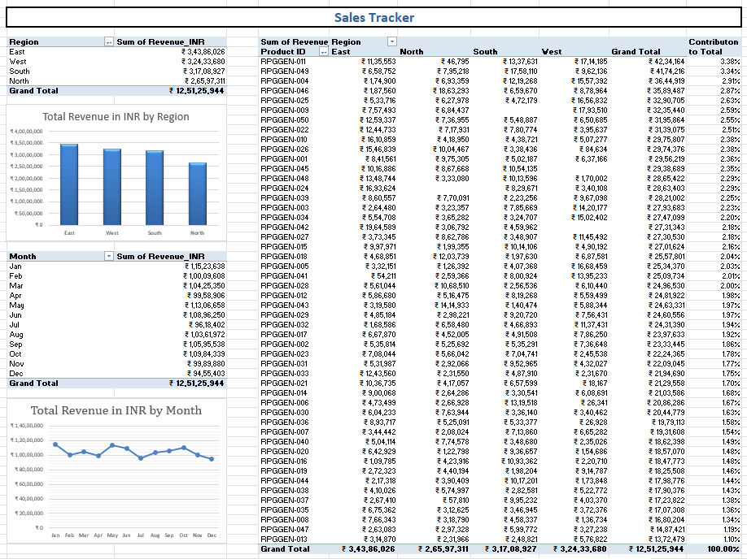
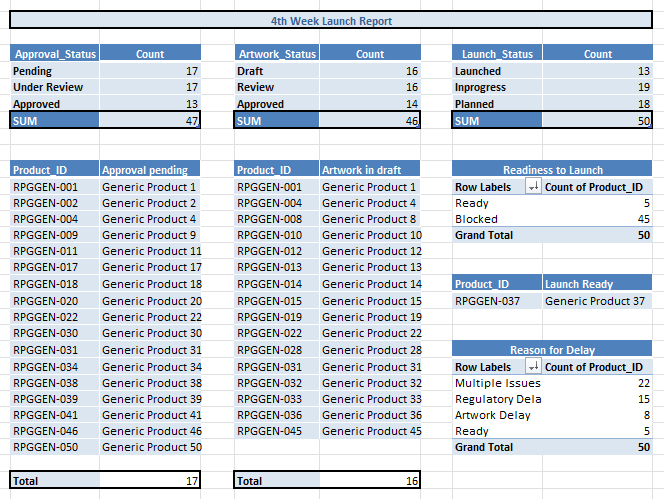
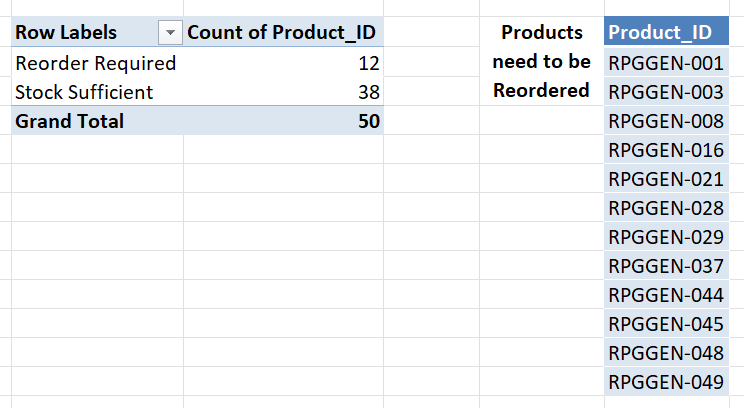
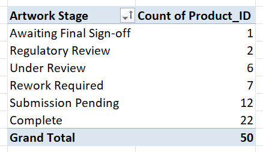

# Pharmaceutical-Strategy-Analytics

## Overview

This project demonstrates how Microsoft Excel can be used to analyze pharmaceutical operations data and support business decision-making. The analysis simulates real-world operational workflows, including product launch tracking, sales performance analysis, inventory management, and artwork approval monitoring.

---

## Project Objectives

* Track product launch readiness
* Monitor regulatory and artwork approval status
* Analyze regional and monthly sales performance
* Identify products requiring inventory replenishment
* Generate operational insights using Excel

---

## Files

* **Strategy_Dataset_final.xlsx** – Final workbook containing analysis and reports.
* **Raw_Strategy_Dataset.xlsx** – Raw operational dataset.
* **sales_tracker.png** – Sales analysis report.
* **4th_week_report.png** – Product launch analysis.
* **reorder_plan.png** – Inventory and reorder analysis.
* **artwork_analysis.png** – Artwork pipeline analysis.

---

## Analysis Performed

### Product Launch Analysis

* Launch status monitoring
* Approval status tracking
* Artwork status analysis
* Launch readiness evaluation
* Delay reason analysis

### Sales Analysis

* Revenue by region
* Monthly revenue trend
* Product contribution analysis

### Inventory Analysis

* Reorder monitoring
* Stock sufficiency analysis
* Products requiring replenishment

### Artwork Pipeline Analysis

* Artwork workflow stages
* Regulatory review tracking
* Final sign-off monitoring

---

## Key Insights

* Only **10%** of products are currently launch-ready.
* Regulatory approvals remain a major operational bottleneck.
* Multiple operational issues are the leading cause of launch delays.
* East region generated the highest overall revenue.
* Twelve products require immediate inventory replenishment.
* Artwork activities remain active across multiple workflow stages.

---

## Tools Used

* Microsoft Excel
* Pivot Tables
* Pivot Charts
* Excel Formulas
* Conditional Formatting
* Business Analytics

---

# Preview

## Sales Analysis

---

## Launch Analysis

---

## Inventory Analysis

---

## Artwork Pipeline Analysis

---

## Disclaimer

This project uses a simulated pharmaceutical operations dataset created solely for educational and portfolio purposes. It does not represent operational data from any pharmaceutical company.
